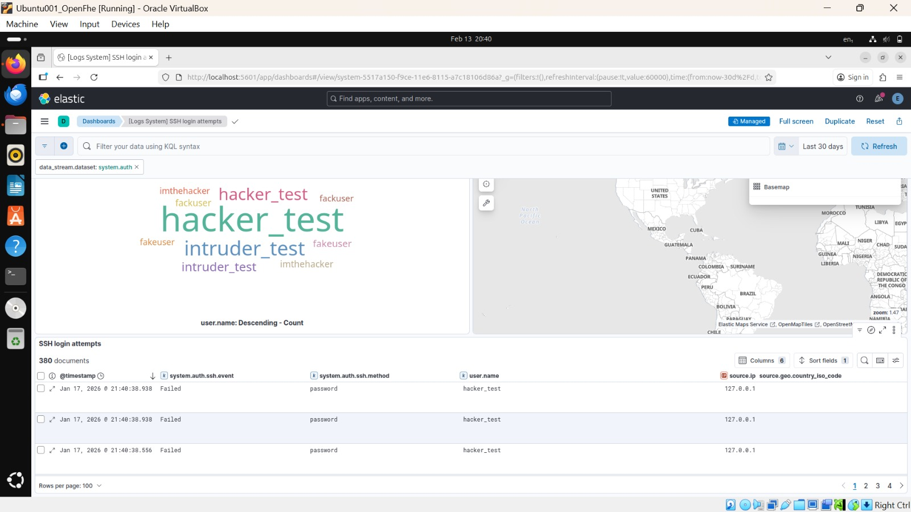
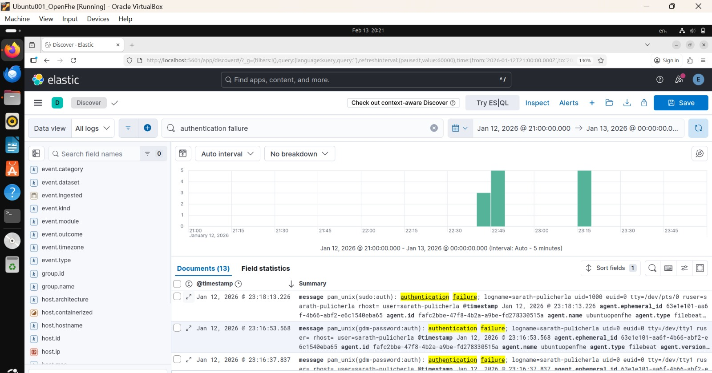

# Incident Report – SSH Brute Force Attack
## Incident Summary

On 12 Jan 2026 , multiple failed SSH authentication attempts were detected against a Linux host (ubuntuopenfhe). The activity was identified by Elastic SIEM and classified as an SSH Brute Force attack aligned with the MITRE ATT&CK framework.

## Detection Source

- Platform: Elastic Security (SIEM)

- Data Source: Linux system authentication logs (journald)

- Rule Triggered: SSH Brute Force – Multiple Failed Login Attempts

- Severity: Medium

- Tactic: Credential Access

- Technique: Brute Force (T1110)

- Sub-technique: Password Guessing

## Timeline of Events

- Multiple failed SSH login attempts observed within a short time window

- Alerts generated automatically by Elastic prebuilt detection rules

- No successful authentication detected following the failed attempts

## Findings

- Successful Login:
 No successful SSH login detected

- Privilege Escalation:
 No privilege escalation activity observed

- Source IP:
 Source IP was not consistently captured in the alert metadata

- User Accounts Targeted:
Local Linux user accounts via SSH

## Impact Assessment

- No unauthorized access gained

- No system or data integrity compromised

- Attack remained at the attempt phase

- Risk classified as Moderate, due to repeated credential guessing behavior

## Investigation Performed

- Reviewed Elastic Security alerts and event details

- Analyzed raw authentication logs in JSON format

- Correlated failed login attempts with host activity

- Verified absence of post-authentication actions

## Mitigation & Recommendations

- Enforce strong password policies

- Implement SSH key-based authentication

- Limit SSH access using firewall rules

- Enable IP reputation and threat intelligence feeds

- Configure alert escalation for repeated attempts

- Consider blocking offending IPs automatically

## Lessons Learned

- Early detection prevented unauthorized access

- SIEM visibility is critical for brute force detection

- Automated alerting reduces response time

- Logging completeness (IP capture) should be improved

## Status

 - Incident contained
 - No further action required
 - Monitoring continues

## Analyst

Sarath Pulicherla
SOC / Cybersecurity Analyst (Hands-on Project)

## Tools Used

- Elastic SIEM

- Elastic Agent

- Linux (Ubuntu)

- MITRE ATT&CK Framework

## Evidence

- Elastic Security alerts

- Authentication log entries (JSON)

- Detection rule metadata

## Incident Overview
Short summary:

- SSH brute force detected

- Multiple authentication failures

- Alert triggered in Elastic Security

## Evidence collection( Log Analysis)

